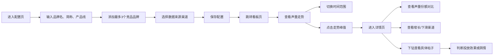

## 1. 产品概述
面向品牌市场部负责人的 Web 声量竞品分析看板，帮助用户每天快速判断自家品牌在全网讨论中的位置，通过数据驱动决策市场投放和舆情应对策略。
- 核心价值：整合多平台声量数据，提供品牌与竞品的横向对比和趋势洞察
- 目标用户：品牌市场部负责人、公关经理、数据分析人员
- 核心场景：每日早会数据简报、活动周期效果复盘、突发舆情快速响应

## 2. 核心功能

### 2.1 用户角色
| 角色 | 注册方式 | 核心权限 |
|------|----------|----------|
| 市场部负责人 | 账号登录 | 配置品牌与竞品、查看全部看板数据、导出分析报告 |
| 普通分析师 | 账号登录 | 查看看板数据、筛选维度分析 |

### 2.2 功能模块
1. **配置页**：品牌词配置、竞品词配置、数据源选择
2. **看板页**：声量走势总览、多平台趋势对比、核心指标卡片
3. **详情页**：声量份额对比、渠道增长分析、热点内容下钻

### 2.3 页面详情
| 页面名称 | 模块名称 | 功能描述 |
|----------|----------|----------|
| 配置页 | 品牌词配置 | 输入品牌名、常见简称、产品线名称，支持多关键词组合 |
| 配置页 | 竞品词配置 | 添加最多 3 个竞品品牌及其简称，支持快速编辑 |
| 配置页 | 数据源配置 | 选择微博、短视频、新闻、论坛等数据来源渠道 |
| 配置页 | 配置保存 | 保存配置后自动跳转至看板页，支持后续修改 |
| 看板页 | 顶部导航 | 品牌名称展示、时间范围切换、页面跳转入口 |
| 看板页 | 核心指标卡片 | 展示今日总声量、环比变化、声量份额排名等关键指标 |
| 看板页 | 声量走势图 | 按来源分曲线展示近 30 天声量变化趋势，支持缩放查看 |
| 看板页 | 平台分布卡片 | 各平台声量占比饼图，快速了解主要讨论来源 |
| 看板页 | 竞品对比表 | 品牌与竞品在各平台的声量数据横向对比表格 |
| 详情页 | 时间范围选择 | 支持昨天、近 7 天、活动周期（自定义）三种时间维度 |
| 详情页 | 声量份额对比 | 环形图展示各品牌在总声量中的占比 |
| 详情页 | 增长最快平台 | 卡片式展示环比增长率最高的 3 个平台及其数据 |
| 详情页 | 下滑渠道预警 | 红色预警卡片展示声量突然下滑的渠道，标注下降幅度 |
| 详情页 | 热点内容下钻 | 点击走势峰值弹窗展示拉动声量的具体帖子列表 |
| 详情页 | 帖子详情卡片 | 展示帖子标题、传播账号、情绪倾向标签、原文链接跳转 |

## 3. 核心流程
用户首次使用时进入配置页，完成品牌与竞品配置后进入看板页查看声量走势；在看板页可切换时间范围，点击趋势峰值进入详情页查看声量份额对比和热点内容；在详情页可进一步下钻查看具体帖子内容，判断是广告投放效果还是舆情事件。

## 4. 用户界面设计

### 4.1 设计风格
- **主色调**：深空蓝 `#0F172A` 作为背景主色，搭配专业蓝 `#3B82F6` 作为品牌主色
- **强调色**：翡翠绿 `#10B981` 表示正向增长，火焰红 `#EF4444` 表示负向下滑，琥珀橙 `#F59E0B` 表示预警
- **字体**：使用 `Inter` 作为数据展示字体，`Noto Sans SC` 作为中文内容字体，数字使用等宽字体增强可读性
- **布局风格**：卡片式栅格布局，数据可视化区域占比 70%，简洁专业的数据看板风格
- **按钮风格**：圆角 6px，中等高度，悬停时有微妙的背景色变化和阴影过渡
- **图标风格**：使用线性风格图标，保持与数据看板的专业感一致

### 4.2 页面设计概述
| 页面名称 | 模块名称 | UI 元素 |
|----------|----------|----------|
| 配置页 | 品牌配置区域 | 表单输入框、标签式关键词管理、动态添加按钮 |
| 配置页 | 竞品配置区域 | 卡片式竞品列表、最多 3 个限制提示、快速编辑删除 |
| 配置页 | 数据源选择 | 复选框网格布局、各平台图标、选中态高亮 |
| 配置页 | 操作区域 | 保存按钮、预览按钮、重置按钮 |
| 看板页 | 顶部导航栏 | 品牌 Logo、时间范围下拉、页面切换 Tab、配置入口 |
| 看板页 | KPI 卡片区域 | 4 张核心指标卡片，大数字展示、环比箭头、趋势迷你图 |
| 看板页 | 主趋势图区域 | 面积图展示总声量、多色折线区分各平台、悬停数据提示 |
| 看板页 | 平台分布区域 | 环形图展示占比、右侧图例、点击高亮对应平台 |
| 看板页 | 竞品对比表格 | 斑马纹表格、数据条形图、排序功能 |
| 详情页 | 时间范围选择器 | 三态切换按钮组、自定义日期选择器 |
| 详情页 | 份额对比区域 | 大型环形图、品牌配色区分、中心展示总声量 |
| 详情页 | 增长渠道卡片 | 绿色渐变背景、上升箭头、增长率大字展示 |
| 详情页 | 下滑预警卡片 | 红色渐变背景、下降箭头、下降幅度大字、预警图标 |
| 详情页 | 热点内容列表 | 可展开卡片、情绪标签（正/负/中性）、账号头像、跳转链接 |

### 4.3 响应式设计
- **桌面端优先**：1280px 以上宽度为主要设计基准，采用 12 列栅格系统
- **平板适配**：768px-1279px 宽度，卡片自动换行，图表保持等比例缩放
- **移动端**：375px-767px 宽度，单列布局，图表可横向滚动查看，简化数据展示
- **触摸优化**：按钮最小高度 44px，确保移动端点击区域足够，图表支持双指缩放

### 4.4 数据可视化规范
- **图表类型**：趋势使用面积图/折线图，占比使用环形图，对比使用横向条形图
- **动画效果**：数据加载时使用渐进式动画，图表从下到上渐入，数值从 0 滚动到目标值
- **交互规范**：悬停显示详细数据，点击可下钻，图例可点击隐藏/显示对应数据系列
- **颜色编码**：品牌固定使用蓝色系，竞品分别使用紫色、橙色、青色系，保持各页面颜色一致
