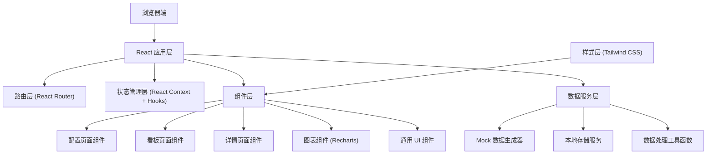
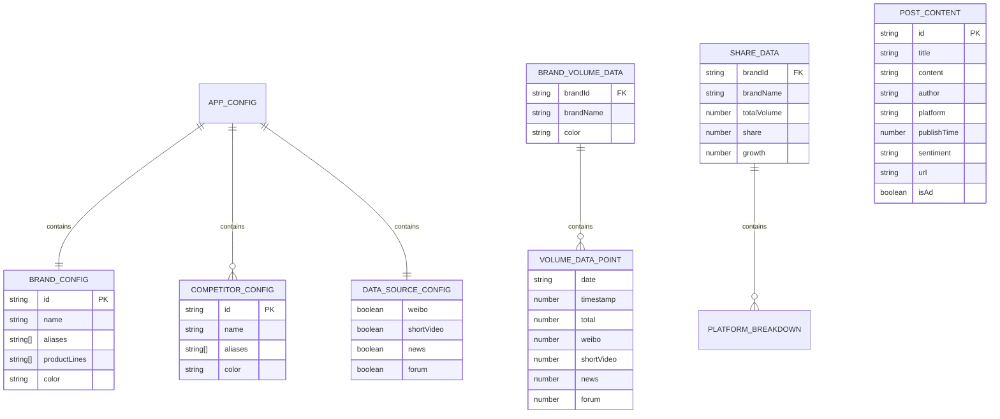

## 1. 架构设计



## 2. 技术描述
- **前端框架**：React@18 + TypeScript + Vite@5
- **路由管理**：React Router@6
- **样式方案**：Tailwind CSS@3
- **图表库**：Recharts@2
- **图标库**：Lucide React
- **数据存储**：LocalStorage 持久化用户配置
- **数据方案**：内置 Mock 数据生成器，模拟真实声量数据
- **构建工具**：Vite@5
- **代码规范**：ESLint + TypeScript 严格模式

## 3. 路由定义
| 路由 | 页面 | 权限 | 说明 |
|------|------|------|------|
| `/` | 重定向 | - | 根据是否已配置重定向到 `/dashboard` 或 `/config` |
| `/config` | 配置页 | 公开 | 品牌词、竞品词、数据源配置 |
| `/dashboard` | 看板页 | 需配置 | 声量走势总览、多平台趋势对比 |
| `/details` | 详情页 | 需配置 | 声量份额对比、热点内容下钻 |
| `/*` | 404 页 | 公开 | 不存在页面的友好提示 |

## 4. 数据模型

### 4.1 核心数据结构定义

```typescript
// 品牌配置
interface BrandConfig {
  id: string;
  name: string;
  aliases: string[];
  productLines: string[];
  color: string;
}

// 竞品配置
interface CompetitorConfig {
  id: string;
  name: string;
  aliases: string[];
  color: string;
}

// 数据源配置
interface DataSourceConfig {
  weibo: boolean;
  shortVideo: boolean;
  news: boolean;
  forum: boolean;
}

// 用户全局配置
interface AppConfig {
  brand: BrandConfig;
  competitors: CompetitorConfig[];
  dataSources: DataSourceConfig;
  createdAt: number;
  updatedAt: number;
}

// 声量数据点
interface VolumeDataPoint {
  date: string;
  timestamp: number;
  total: number;
  weibo: number;
  shortVideo: number;
  news: number;
  forum: number;
}

// 品牌声量数据
interface BrandVolumeData {
  brandId: string;
  brandName: string;
  color: string;
  data: VolumeDataPoint[];
}

// 声量份额
interface ShareData {
  brandId: string;
  brandName: string;
  color: string;
  totalVolume: number;
  share: number;
  growth: number;
  platformBreakdown: {
    platform: string;
    volume: number;
    share: number;
    growth: number;
  }[];
}

// 平台增长数据
interface PlatformGrowth {
  platform: string;
  platformName: string;
  growthRate: number;
  currentVolume: number;
  previousVolume: number;
  trend: 'up' | 'down' | 'stable';
}

// 帖子内容
interface PostContent {
  id: string;
  title: string;
  content: string;
  author: string;
  authorAvatar: string;
  platform: string;
  publishTime: number;
  sentiment: 'positive' | 'negative' | 'neutral';
  url: string;
  engagement: {
    likes: number;
    comments: number;
    shares: number;
  };
  isAd: boolean;
}

// 时间范围
type TimeRange = 'yesterday' | '7days' | 'custom';
```

### 4.2 数据模型 ER 图



## 5. 目录结构

```
src/
├── components/              # 通用组件
│   ├── layout/             # 布局组件
│   │   ├── Header.tsx
│   │   ├── Navigation.tsx
│   │   └── PageContainer.tsx
│   ├── charts/             # 图表组件
│   │   ├── VolumeTrendChart.tsx
│   │   ├── SharePieChart.tsx
│   │   ├── PlatformBarChart.tsx
│   │   └── MiniSparkline.tsx
│   ├── cards/              # 卡片组件
│   │   ├── KPICard.tsx
│   │   ├── PlatformGrowthCard.tsx
│   │   ├── WarningCard.tsx
│   │   └── PostCard.tsx
│   └── ui/                 # 基础 UI 组件
│       ├── Button.tsx
│       ├── Input.tsx
│       ├── Tag.tsx
│       ├── Badge.tsx
│       └── Modal.tsx
├── pages/                  # 页面组件
│   ├── ConfigPage.tsx
│   ├── DashboardPage.tsx
│   └── DetailsPage.tsx
├── context/                # 状态管理
│   └── AppContext.tsx
├── hooks/                  # 自定义 Hooks
│   ├── useVolumeData.ts
│   ├── useShareData.ts
│   └── usePostContent.ts
├── services/               # 数据服务
│   ├── mockData/           # Mock 数据生成
│   │   ├── volumeGenerator.ts
│   │   ├── shareGenerator.ts
│   │   └── postGenerator.ts
│   ├── storage.ts          # 本地存储服务
│   └── configService.ts    # 配置服务
├── utils/                  # 工具函数
│   ├── dateUtils.ts
│   ├── numberUtils.ts
│   └── colorUtils.ts
├── types/                  # TypeScript 类型定义
│   └── index.ts
├── App.tsx
├── main.tsx
└── index.css
```

## 6. 关键技术实现点

### 6.1 配置持久化
- 使用 LocalStorage 存储用户配置，Key 为 `soundboard_config`
- 应用启动时检查配置，未配置则跳转配置页
- 配置变更自动同步到本地存储

### 6.2 Mock 数据生成
- 基于真实的社交媒体声量规律生成模拟数据
- 包含工作日/周末波动、活动峰值、随机波动
- 支持按日期范围动态生成数据

### 6.3 图表交互
- 走势图表支持点击峰值数据点触发详情下钻
- 饼图/环形图支持图例点击筛选
- 所有图表支持响应式布局和动画效果

### 6.4 路由保护
- 使用 React Router 的 loader 机制检查配置状态
- 未配置用户访问看板页/详情页自动重定向到配置页

### 6.5 性能优化
- 使用 React.memo 优化图表组件重渲染
- 数据使用 useMemo 缓存计算结果
- 路由懒加载减少首屏加载时间
